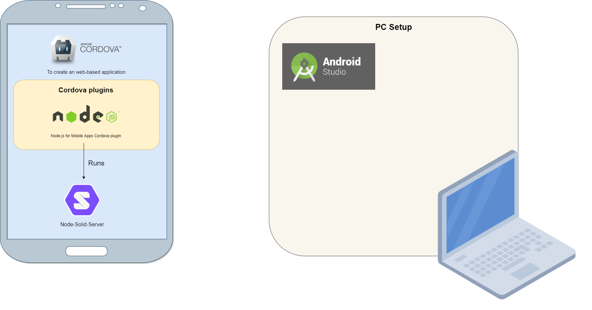

# Node Solid Server on mobile using Cordova
This is an experimental repository. The idea is to run the Node-Solid-Server on mobile. I found a repository that allows nodejs to be run on mobile using Cordova and build upon that, but there are some things that need to be fixed in order to make it work. One of them is the compatibilty of using the Android file system with the Node-Solid-Server.



_This is not working, but offers an experiment to work further on and helpful information._

For more information on Solid:
https://solidproject.org/

The following package is used to be able to run a node server on mobile:
https://github.com/JaneaSystems/nodejs-mobile-cordova

The following packe is the node-solid-server:
https://github.com/solid/node-solid-server

---

## How to run
In `www\nodejs-project` run:

```bash
npm install
```

Add the android platform in the root folder:

```bash
$ cordova plugin add nodejs-mobile-cordova
$ cordova plugin add cordova-plugin-console
$ cordova platform add android@7.1.4
```

> If you encounter `unable to load PlatformApi`, see https://stackoverflow.com/questions/46799446/cordova-unable-to-load-platformapi

<br />

Now open `platforms/android project` in Android Studio

In `app\build.gradle` change: 

	cdvPrintProps << { 
	...
	}
	
to 

	cdvPrintPros { doLast {
		...
		}
	}


In android\build.gradle change:
    
	dependencies {
        // NOTE: Do not place your application dependencies here; they belong
        // in the individual module build.gradle files
        classpath 'com.android.tools.build:gradle:3.0.1'
    }
	
to
	
	dependencies {
        // NOTE: Do not place your application dependencies here; they belong
        // in the individual module build.gradle files
        classpath 'com.android.tools.build:gradle:4.0.0'
    }


---

## General information

### Cordova Plugins
- cordova-plugin-whitelist
- cordova-plugin-console : 1.1.0
- nodejs-mobile-cordova  : 0.4.2
- cordova-plugin-file    : 6.0.2

### Set-up information
User variables:
- ANDROID_NDK_HOME - C:\Users\username\AppData\Local\Android\Sdk\ndk\21.1.6352462
- ANDROID_SDK_ROOT - C:\Users\username\AppData\Local\Android\Sdk
- JAVA_HOME - C:\Program Files\Java\jdk1.8.0_271\
- path
	- C:\Program Files\Java\jre1.8.0_281\bin
	- C:\Program Files\Java\jdk1.8.0_271\bin

System variables:
- CORDOVA_ANDROID_GRADLE_DISTRIBUTION_URL - https://services.gradle.org/distributions/gradle-6.5-all.zip
- path
	- C:\Program Files\Java\jre1.8.0_281\bin
	- C:\Program Files\Java\jdk1.8.0_271\
	- C:\Program Files\CMake\bin
	- C:\Users\username\.gradle\wrapper\dists\gradle-6.5-all\2oz4ud9k3tuxjg84bbf55q0tn\gradle-6.5\bin


---

## Common errors

> If one of the cordova plugins is not found, for example "nodejs module is not found", then try to
re-install all plugins.

> If one of the node-js modules is not found, do `npm install` in www\nodejs-project.

> When there is an error about the NDK version being non-existent download the one needed in Android Studio -> SDK manager -> SDK Tools -> make sure you click `show packages` -> NDK (Side by side)

> For the error: `More than one file was found with OS independent path 'lib/arm64-v8a/libnode.so'.`, search for jniLibs using `ctrl + shift + F` and comment the following lines: <br />
`android.sourceSets.main.jniLibs.srcDirs += 'libs/cdvnodejsmobile/libnode/bin/';` <br />
`jniLibs.srcDirs = ['libs']`

---

## Helpful for the future

Writing to files in cordova
https://stackoverflow.com/questions/34694139/where-is-the-location-of-file-created-by-cordova-file-plugin